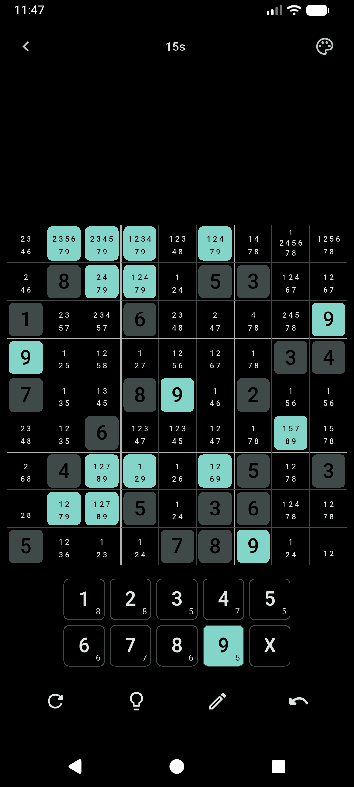
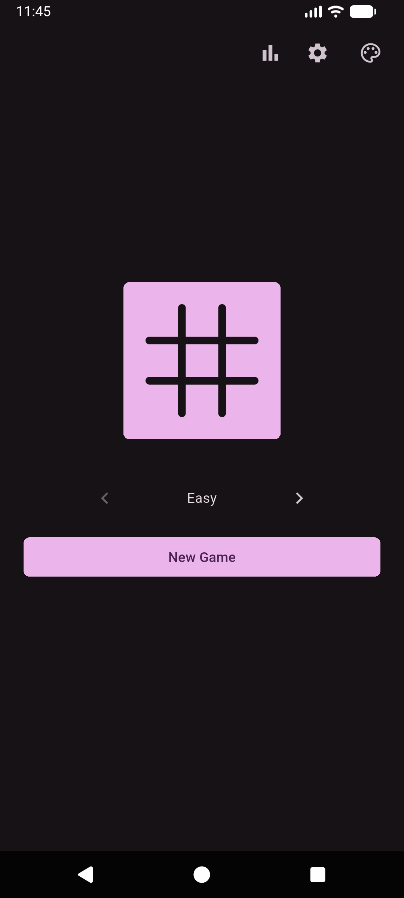
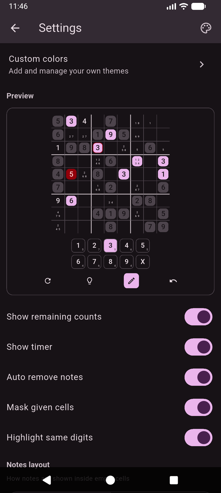
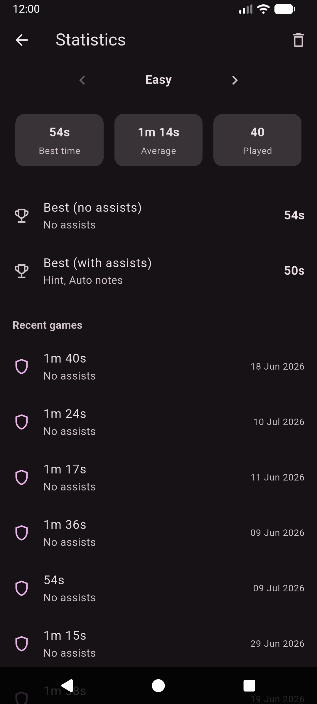

# Sudoku

A cross-platform Sudoku app built with Flutter. Generates unique puzzles with varying difficulty using logical solving techniques


[](https://github.com/likhithpraveenk/sudoku/releases)
[](https://www.gnu.org/licenses/gpl-3.0)

[](https://f-droid.org/packages/com.likhithpraveenk.sudoku)
[](https://github.com/likhithpraveenk/sudoku/releases/latest)
[](https://apps.obtainium.imranr.dev/redirect.html?r=obtainium://add/https://github.com/likhithpraveenk/sudoku)

## Features

- **Difficulty** - difficulty is derived from the techniques required to solve a puzzle (Hidden Single, Naked Pair, X-Wing, Swordfish, …)
- **In-game assists** - notes/pencil marks, auto-notes, undo, conflict highlighting, and validation
- **Statistics & leaderboard** - track solve times per difficulty, with a top-10 board on the solved overlay
- **Resume** - the current game is persisted locally so you can continue where you left off
- **Theming** - light/dark and custom color themes with a live preview
- **Responsive layout** - adapts controls placement for phone and larger screens

## Screenshots

|                                                                                                          |                                                                                                |                                                                                             |                                                                                               |
| :------------------------------------------------------------------------------------------------------: | :--------------------------------------------------------------------------------------------: | :-----------------------------------------------------------------------------------------: | :-------------------------------------------------------------------------------------------: |
|  |  |  |  |

## Architecture

The codebase follows a layered design:

- `lib/domain/` - pure Sudoku logic: models, solving techniques, solver, generator, and the `GameEngine` that owns all in-game mutations
- `lib/data/` - persistence layer (Hive boxes and save/load services).
- `lib/providers/` - Riverpod providers that wire domain and data together
- `lib/presentation/` - widgets, screens, and presentation-only models

## Getting Started

```bash
flutter pub get
flutter run
```

## Testing

```bash
flutter test
```

## AI Policy

This project was developed with the assistance of LLMs and coding agents. They were used for scaffolding and implementing Sudoku solving techniques. All AI-generated changes were reviewed by me before being committed

## License

Sudoku is licensed under the [GNU General Public License v3.0](LICENSE.txt).

```text
Sudoku
Copyright (C) 2026 Likhith Praveen K

This program is free software: you can redistribute it and/or modify
it under the terms of the GNU General Public License as published by
the Free Software Foundation, either version 3 of the License, or
(at your option) any later version.
```
